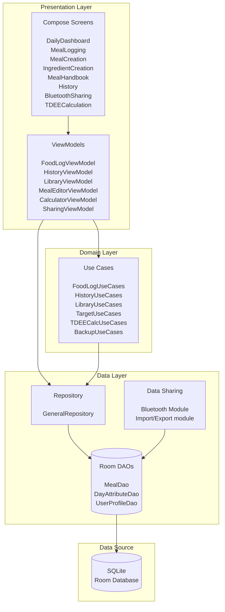
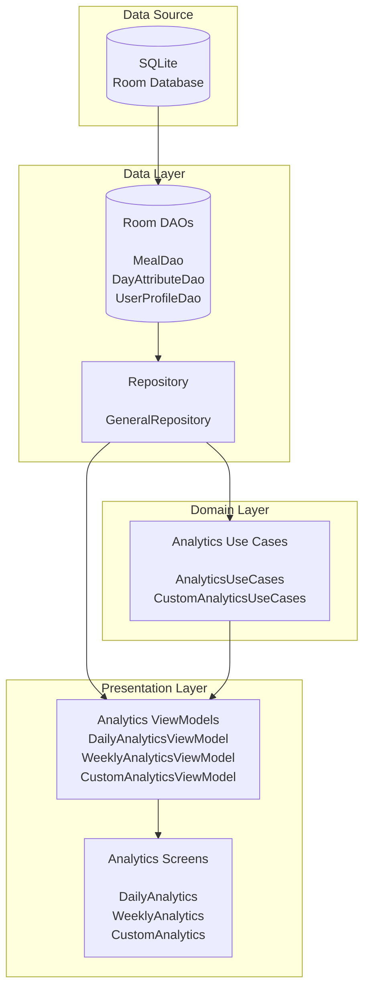

<p align="center">

</p>

## TL;DR

|  | **Details** |
|----------|-------------|
| **Платформа** | Android (Kotlin) |
| **Архитектура** | MVVM + Clean Architecture + Room(SQLite) |
| **Ключевые функции** | Передача блюд между пользователями с умным разрешением конфликтов, аналитический модуль|
| **Философия** | 100% оффлайн, никаких аккаунтов, никаких реклам, никакого облака |
| **Статус** | Скоро в RuStore (Апрель-Май 2026) |
| **Языки** | Русский, Английский
| **Tech Highlights** | FTS4, Bluetooth Classic, Jetpack Compose, Hilt |

**Почему я сделал именно это приложение:** Мейнстримные трекеры КБЖУ заставляют пользователя выбирать блюда из их базы, даже если точные совпадения отсутствуют. Blush позволяет пользователю строить точную базу данных самостоятельно, делиться ей с другими пользователями по Bluetooth, а также изучать свои диетарные привычки с помощью встроенного аналитического модуля.

# Blush
**Offline-first трекер КБЖУ, построенный в соответствии с принципом "меньше - значит больше", предлагающий пользователю максимум информации о его пищевых привычках и диете при минимальной активности со стороны самого пользователя**

Blush идет в направлении противоположном всем мейнстримным фитнес-приложениям на рынке - никаких подписок, реклам, облачной синхронизации, внутренних соц. сетей или перегруженного интерфейса. Дизайн и функционал разрабатывался строго в соответствии с предпочтениями людей, действительно пользующихся этими приложениями, отчего в фокусе в первую очередь стояли именно простота и удобство в использовании, а не максимальная монетизация.

Приложение будет доступно для скачивания на платформе RuStore ориентировочно к концу апреля 2026 года. Минимальное SDK - 30 (Android 11 или выше).

<details><summary><b>Интерфейс</b></summary>
  
  
  
  
  
  
  
  
  

</details>

## История проекта
Идея проекта возникла из личной нужды — существующие трекеры калорий в большинстве своем предлагали ограниченный список продуктов и блюд, который было невозможно дополнить без подписки/предварительной модерации нововведения администраторами приложения. Это приводило к большим проблемам при попытке рассчитать КБЖУ потребляемой пищи, так как приходилось находить не то, что было съедено, а то, что приблизительно похоже на это, отчего данные были крайне неточными.
Кроме того, их интерфейс всегда вызывал у меня острое отторжение - календари, какие-то форумы, рекламы, разделение дневника по времени суток(???), миллион лишних опций, которые едва ли вообще будут нажаты рядовым пользователем, но которые на постоянной основе загрязняют интерфейс своим существованием.

Возможно, если бы эти проблемы были лишь моими, я бы и привык к этим недостаткам. Однако в один день, когда моя жена безуспешно провела 10 минут в попытках ввести в другом трекере в дневное потребление бургер без соуса, идея решить эту проблему намертво закрепилась в моей голове.
Kotlin и вообще сама по себе разработка на Android были для меня совершенно новой сферой, однако спустя несколько месяцев проб и ошибок все наконец получилось в таком виде, в каком я могу с уверенностью презентовать Blush его потенциальным пользователям.

## Функционал приложения

<details><summary><b>Флоу логирования блюд</b></summary>

  ```mermaid
flowchart TD
    Start([User wants to log food]) --> CheckMeal{Does meal<br/>exist in DB?}
    
    CheckMeal -->|Yes| SelectWeight{Full or<br/>Custom?}
    CheckMeal -->|No| CreateFlow[Create Meal Flow]
    
    %% Create Meal Branch
    CreateFlow --> SimpleOrComp{Simple or<br/>Composite?}
    SimpleOrComp -->|Simple| CreateSimple[Enter basic info<br/>Name, weight, total macros]
    SimpleOrComp -->|Composite| CheckIngredients{Do ingredients<br/>exist in DB? }
    
    CheckIngredients --> |Yes| BuildMeal[Build Composite Meal<br/>Add ingredients + ratios]
    CheckIngredients --> |No| CreateIngredients[Create Ingredients<br/>Add macros per 100g]
    CreateIngredients --> SaveIngredient[Save to Room DB]
    SaveIngredient --> BuildMeal[Build Composite Meal<br/>Add ingredients + ratios]
    CreateSimple --> SaveMeal[Save to Room DB]
    BuildMeal --> SaveMeal
    
    %% Back to logging
    SaveMeal --> SelectWeight
    
    %% Existing Meal Branch
    SelectWeight -->|Full| AddToDay[Create DailyLogEntry<br/>Link to Meal + Date]
    SelectWeight -->|Custom| EnterWeight[Enter weight of meal eaten]
    
    EnterWeight --> Calc[Calculate]
    
    Calc --> AddToDay[Create FoodLog<br/>Log Meal + Date + Time]
    AddToDay --> UpdateDay[Update DailyTotals<br/>in ViewModel and DB]
    UpdateDay --> ShowUI[Update UI with<br/>remaining calories and macros]
```

</details>

<details><summary><b>Логирование блюд</b></summary>
  
### Логирование блюд
  
Я разделил виды пищи на "Простое блюдо", "Сложное блюдо" и "Ингредиент":
- Простое блюдо — это цельное блюдо без ингредиентов, в котором КБЖУ прописано напрямую, как с этикетки на товаре. При добавлении простого блюда пользователь указывает вес и КБЖУ на полный вес блюда. Сюда попадают товары "магазинные", блюда в кафе и ресторанах с указанными параметрами КБЖУ и прочими видами пищи, в которой нет ингредиентов или невозможно узнать их список.
  
- Ингредиент - это продукт, который не добавляется в дневник напрямую и является промежуточным звеном. В ингредиентах указывается их КБЖУ на 100 грамм, а затем они используются при формировании сложного блюда. Сюда входят продукты, которые чаще всего используются при готовке полных блюд. Например, картошка, говяжья вырезка или яблоко
  
- Сложное блюдо - это блюдо, КБЖУ которого составляется не напрямую пользователем, а из ингредиентов, из которых оно состоит. При создании сложного блюда пользователь добавляет в карточку только ингредиенты и их вес, а затем приложение самостоятельно подсчитывает итоговую пищевую ценность блюда.
  
Так как далеко не всегда человек может съесть целиком батон хлеба или плитку шоколада, при добавлении блюда в дневную статистику существует опциональный промежуточный этап, где пользователь указывает вес съеденного блюда. При выборе данного режима логирования, пищевая ценность блюд в списке пользователя представляется не в оригинальном объеме, а в КБЖУ/100 грамм. При нажатии на блюдо в этом режиме пользователю предлагается указать нужный вес, на основании которого затем рассчитывается КБЖУ. 

В стандартном режиме логирование блюда происходит без дополнительных диалоговых окон напрямую. 
В целях предоставления аналитических данных по потреблению пользователя, приложение также запоминает дату и время каждого добавленного в дневник блюда, на основании чего затем формирует ряд советов по питанию.
  </details>
  <details><summary><b>Дневник и калькулятор нормы</b></summary>
    
### Дневник и калькулятор нормы
#### Калькулятор
Приложение не предполагает знание пользователем нормы его потребления и вместо этого предлагает ему рассчитать ее с помощью встроенного калькулятора. На основании пола, возраста, роста, уровня активности и цели приложение рассчитывает норму КБЖУ и потребления воды для человека, в соответствии с которой затем выстраиваются графики аналитики, дневные цели и дашборд на главном экране. Приложение придерживается принципа максимального удобства, а потому вместо автоматического расчета пользователь может применить собственный и просто вручную указать свои нормы КБЖУ и воды.
#### Дневник
На главном экране приложения расположен Дневник — это дашборд, с которого производится логирование блюд (нажатием FAB в нижнем правом углу), логирование потребляемой воды, а также трекинг дневных показателей пользователя и переход в настройку дневных показателей/калькулятор. Отсюда нажатием на огонёк пользователь может также посмотреть список съеденных за день блюд и удалить ненужные при необходимости. Кнопка в форме бургера позволяет включить режим Cheat Meal, при котором данные текущего дня не записываются в статистику для аналитики. 
Также на странице дневника можно просмотреть данные предыдущих дней, включая данные по отдельным блюдам. 
  </details>
  <details><summary><b>Передача данных</b></summary>

    
### Передача данных
#### Импорт/экспорт json
Для миграции данных целиком между устройствами в приложении реализован функционал импорта/экспорта в формате json. При необходимости нажатием одной клавиши пользователь выгружает файл, который затем может также загрузить обратно в приложение для заполнения хранилища на новом устройстве старыми данными
#### Bluetooth
Для передачи конкретно самих блюд и ингредиентов в приложении также реализован функционал classic bluetooth. Сперва получатель данных выбирает роль получателя и включает bluetooth, открывая видимость своего устройства прочим устройствам вокруг на 300 секунд. Затем отправитель заходит в соответствующий режим и выбирает блюда/ингредиенты, которые хочет отправить получателю, и находит его устройство в открывшемся списке. 
Затем, при установлении подключения происходит обмен данными. Обмен, как правило, мгновенный — пока что при тестировании не удавалось заметить неполадок или задержек при передаче данных. 
Ключевая особенность этой передачи в том, что сложные блюда передаются не обособленно, а вместе с включенными в них ингредиентами, освобождая пользователя от излишних перепроверок и запоминаний списка ингредиентов. На экране получателя также можно выбрать, перезаписать имеющиеся блюда/ингредиенты с такими же названиями или же оставить локальные копии для случаев, для разрешения конфликтов одинакового названия.
  </details>
  <details><summary><b>Аналитика</b></summary>
    
### Аналитика
Этот модуль — самый обширный в приложении и включает в себя на данный момент 3 режима аналитики: дневной, недельный и настраиваемый. 
#### Дневная аналитика
Данный режим позволяет в деталях изучить качество диеты пользователя в конкретный выбранный день. Здесь можно увидеть общую оценку дня, дневные показатели, прогноз изменения веса за день, потребление калорий по времени суток, пищевое окно, разбор съеденных блюд, а также инсайты - советы, генерируемые приложением на основании данных. Так, например, если пользователь ест тяжелую пищу рано утром, приложение предупредит о негативном влиянии тяжелого завтрака на самочувствие, а при тщательном соблюдении дневных норм — похвалит за дисциплину. Список инсайтов очень большой и в будущем еще будет пополняться. 
#### Недельная аналитика
Данный режим позволяет посмотреть статистику недели и тенденции, выявленные у пользователя за этот период. Здесь отсутствует явная разбивка по времени суток и вместо этого присутствуют новые показатели, такие как средние дневные калории, общая оценка недели, стабильность потребления, число заполненных дней, а также график потребления (на основе VICO graphs), в котором можно посмотреть регулярность питания пользователя как общую, так и по отдельных макронутриентам. График динамический и при необходимости в нем можно настраивать отображение только нужных параметров для пользователя. Также дни чит-мила отображены здесь зеленым цветом. 
Ниже можно увидеть перечень инсайтов, расширенный дополнительными пунктами на основании недельных параметров.
#### Настраиваемая аналитика
Это - самый подробный режим аналитики. Он показывает статистику для любого выбранного пользователем временного промежутка и добавляет новые сложные элементы аналитики, такие как анализ привычек и корреляции между макронутриентами.
К уже имевшимся в недельной аналитике метрикам добавляется усредненное значение потребления макронутриентов за период, анализ привычек (потребление в будние дни, потребление в выходные, самые стабильные и нестабильные дни недели, лучшие и худшие дни), динамика потребления (изменения в диете положительные или отрицательные за период), корреляции (углубленные наблюдения в диете пользователя), а также еще более расширенные инсайты. 
  </details>

## Ключевые преимущества
- **Минимализм** - от пользователя требуется только добавлять блюда в дневник питания. Вся аналитика приложения и трекер-функционал строятся вокруг этого единственного действия, избавляя пользователя от излишней ментальной нагрузки
- **Персонализация** - база данных не заполнена мусором, противоречащим друг другу. Пользователь вправе сам изменять и дополнять перечень своих блюд, благодаря чему данные о его питании всегда будут точными
- **Скорость** - благодаря интеграции FTS4 и отсутствию подключения к интернету приложение работает стабильно быстро и надежно, полностью избавляя пользователя от загрузочных экранов даже спустя месяцы активного использования и заполнения базы данных
- **Надежность** - никаких реклам, облаков и прочей связи с внешним миром. Что бы ни случилось, Blush будет работать всегда и в любых условиях
  
## Технические детали
### Архитектура
<details><summary><b>Основа</b></summary>
	

  </details>
Можно заметить, что в отличие от остальных файлов, успешно соблюдающих Clean Architecture, репозиторий у меня получился один на весь файл. Это было осознанное решение - Blush не настолько огромное приложение, чтобы число функций в репозитории мешало поиску нужных для дебаггинга или последующего расширения функционала приложенмя. Разбивка его на несколько отдельных файлов привела бы к появлению микроскопических репозиториев и объективно лишней работе.

Я не включил в основную диаграмму архитектуры аналитику, так как посчитал, что тогда отображение элементов в ней будет недостоверным и вместо этого вывел её в отдельную диаграмму. Аналитический модуль в приложении не производит никаких дополнительных записей в ДБ и просто использует уже существующие данные для построения графиков/формирования инсайтов и прочих показателей. Таким образом, этот модуль в Blush - целиком динамический, и его данные не занимают дополнительного места на устройстве пользователя
<details><summary><b>Аналитический модуль</b></summary>


</details>

### Стек технологий
**UI**: Jetpack Compose, Material3, Vico Graphs

**DI**: Hilt

**Data Transfer**: Bluetooth Classic, JSON(GSON)

**Async**: Kotlin Coroutines, Flow

**DB**: Room(SQlite), FTS4

**Paywall**: RuStore

Теоретически можно было бы хранить настройки пользователя (пол, вес, рост и т.д.) в DataStore вместо полноценной таблицы SQlite, но я узнал о такой возможности уже после того, как новая таблица была реализована в приложении. В контексте этой таблицы я предпочел придерживаться принципа "Работает - не трогай". 

FTS4 использовано вместо FTS5 по той же причине - будучи де-факто самоучкой в сфере, я применял именно те решения, которые в момент изучения вопроса были предложены мне интернетом. В другом моем проекте, сделанном после Blush, уже использованы как DataStore, так и FTS5
### База данных
Хранение данных пользователя реализовано полностью в Room с использованием SQLite. Все запросы в БД написаны на обычном SQL, без использования ОRM-ов. Это положительный побочный эффект моей на ранних этапах разработки слабой осведомленности о таких альтернативах классическому SQL как NoSQL и различные ORM фреймворки. SQL вплоть до JOIN и FOREIGN KEY давалось мне относительно легко на этапе обучения, а потому, когда понадобилось строить базу данных для приложения, у меня не возникало мыслей о том, что, возможно, существуют более простые способы построения DAO. Тем не менее, это оказалось весьма кстати - пусть и незначительно, но написание SQL-запросов напрямую без дополнительных прослоек абстракции позволило снизить оверхэд в БД и на мой субъективный взгляд сделало DAO приложения более прозрачными и удобными для использования.

Содержание БД Blush и взаимосвязи между отдельными таблицами можно увидеть на следующей диаграмме:
  
<details><summary><b>БД Blush</b></summary>

  ```mermaid
erDiagram
    MEAL ||--o{ DAILY_LOG : "logged as"
    MEAL ||--o{ INGREDIENT : "contains (if composite)"
    INGREDIENT ||--o{ INGREDIENT_FTS_UNICODE61 : "gets indexed via"
    MEAL ||--o{ MEAL_INGREDIENTS_CROSS_REF : "gets matched many-to-many in junction table"
    INGREDIENT ||--o{ MEAL_INGREDIENTS_CROSS_REF : "gets matched many-to-many in junction table"
    MEAL {
        int mealId
        string mealName
        int totalCalories
        int totalCarbs
        int totalProtein
        int totalFat
        int weight
    }
    INGREDIENT {
        string id
        string name
		int calories  
		int carbs
		int protein  
		int fat  
		int weight
    }
	WATER_LOG {
		long date
		float cups
	}
	TARGET_LOG {
		long date 
		int goalCalories
		int goalCarbs
		int goalProtein
		int goalFat 
		float goalWater
	}
	DAY_ATTRIBUTES {
		long date  
		boolean isCheatDay
		boolean isTimeTrackingIgnored
		boolean isWaterTrackingIgnored
	}
    INGREDIENT_FTS_UNICODE61 {
	    string name 
		int calories
		int carbs
		int protein  
		int fat
	}
	MEAL_INGREDIENTS_CROSS_REF{
		int mealId
		string ingredientId
		int weight
	}
	USER_PROFILE {
	int id
	string gender
	double weightKg
	double heightCm
	int age  
	string activityLevel
	string goal  
	int tdee  
	long lastUpdated
	}
    DAILY_LOG {
        int id
		long date  
		long timestamp
		string mealName
		int calories
		int carbs 
		int protein
		int fat
		int weight
    }
    DAILY_TOTAL {
        date date
        int totalCalories
        int totalProtein
        int totalCarbs
        int totalFat
    }
    HISTORY_LOG {
	    long date
		int totalCalories  
		int totalCarbs 
		int totalProtein 
		int totalFat 
		float waterCups 
		int goalCalories
		int goalCarbs
		int goalProtein 
		int goalFat
	}
    
    DAILY_LOG ||--|| DAILY_TOTAL : "aggregates into"
    DAILY_TOTAL ||--|| HISTORY_LOG : "aggregates into"
	WATER_LOG ||--|| HISTORY_LOG : "aggregates into"
	USER_PROFILE ||--|| TARGET_LOG : "used to calculate targets"
	TARGET_LOG ||--|| HISTORY_LOG : "is used for setting daily targets"
	DAY_ATTRIBUTES ||--|| HISTORY_LOG : "is used in conjuction with history for analytics"
```
</details>

Список ингредиентов в Blush отличается в своей имплементации от списка блюд для решения проблемы наполнения offline-first трекера калорий. В отличие от блюд, которые почти наверняка будут уникальны для каждого пользователя, ингредиенты, как правило, у всех одинаковые, а потому для удобства использования в Blush был вшит базовый набор из порядка 500 ингредиентов, который автоматически заполнялся в базу данных при первом запуске приложения. Таким образом, тип String был использован для id в первую очередь для удобства заполнения базы ингредиентов стартовыми данными без лишней головной боли.

Также для таблицы ингредиентов была реализована индексация с помощью FTS4. Токенайзер - UNICODE61, для корректной работы с юникодом. FTS реализован в первую очередь для таблицы ингредиентов ввиду потенциального объема этой таблицы - ввиду базового набора ингредиентов и в целом большого разнообразия их в магазинах эта таблица будет заполняться пользователем значительно быстрее, чем таблица блюд, а поиск по ней будет производиться гарантированно каждый раз при добавлении нового сложного блюда. Ввиду небольшого веса самого приложения, дополнительное пространство, занимаемое FTS таблицей, не было сколько-либо значительным фактором против оптимизации поиска. Впоследствии после выпуска приложения в RuStore я планирую также добавить FTS и для таблицы блюд.

Простые и составные блюда в приложении, как можно видеть по диаграмме, реализованы в виде единой таблицы без какого-либо разделения их на отдельные виды. Это было сделано именно так потому что я хотел, чтобы простые и составные блюда находились в единой LazyColumn в Справочнике блюд, а для достижения этого мне нужно было либо придумать способ заполнять LazyColumn из двух источников сразу, либо сделать так, чтобы источник был лишь один. Решение получилось достаточно эффективное - приложение различает простые и составные блюда по наличию ингредиентов внутри. Если список ингредиентов пуст - значит это простое блюдо. Если там есть хоть что-то - составное.

Приложение написано на kotlin для Android, с использованием hilt для инъекции зависимостей, jetpack compose и kotlin coroutines для работы с UI. Использована модель single activity MVVM со следованием принципам SOLID и Clean Architecture в контексте структурирования проекта. Хранилище данных реализовано с помощью Room на базе Sqlite, с применением FTS4 для крупных таблиц. В приложении строго соблюдается принцип offline-only. Обмен данными реализован только с помощью Bluetooth (передача блюд и ингредиентов между пользователями) и импорта/экспорта данных в формате json. 
В приложении присутствует очень подробная аналитика по периодам (день, неделя, настраиваемый период), закрытая пейволлом с использованием Adapty. 
Релиз приложения на платформе RuStore планирую в апреле этого года с дальнейшими дополнениями функционала.

### Обмен данными
Обмен данными в приложении реализован двумя способами: используя Bluetooth Classic и импортируя/экспортируя файлы JSON. 

**Bluetooth Classic**: Сложный функционал, для реализации которого активно применялась помощь ИИ (в частности с его синтаксисом). Передает данные между пользователями в модели Клиент (отправитель) - Сервер (получатель) по Bluetooth соединению, автоматически разрешая конфликты между одинаковыми объектами на основании выбора получателя (оставить свои или заменить собственные данные на данные отправителя) и перезаписывая id ингредиентов для предотвращения захламления справочника получателя множественными копиями одних и тех же объектов.

<details><summary><b>Технические детали</b></summary>
Передача данных реализована с помощью модели Клиент - Сервер через Bluetooth RFCOMM. Данные сериализуются в формат JSON с помощью GSON (предварительно агрегируются из ДБ с помощью снапшотов таблиц блюд и ингредиентов, из которых пользователь самостоятельно выбирает только нужные к отправке данные). Транспортный протокол - кадрирование с префиксом длины для предотвращения склеивания данных.

Флоу сервера(получателя):
```
// Создается серверный сокет со стандартным UUID (00001101-0000-1000-8000-00805F9B34FB)
serverSocket = bluetoothAdapter?.listenUsingRfcommWithServiceRecord("BlushApp", APP_UUID)

// Блокировка потока до подключения клиента
clientSocket = serverSocket?.accept()

// Серверный сокет закрывается (подключение строго между двумя устройствами)
serverSocket?.close()

// Ожидание данных
listenForData(clientSocket!!) // !! использовано т.к. clientSocket во флоу клиента использует оператор безопасного вызова ?
```
Флоу клиента(отправителя):
```
// Создается клиентский сокет, ориентированный на конкретное устройство
clientSocket = device.createRfcommSocketToServiceRecord(APP_UUID)

// Подключение к серверу, блокировка потока до подключения
clientSocket?.connect()

// Меняется значение Boolean переменной для сообщения интерфейсу о том, что подключение успешно
_isConnected.value = true
```
Получатель на этапе создания серверного сокета открывает видимость к своему устройству для прочих поблизости на 300 секунд. Отправитель начинает сканирование для обнаружения всех подключенных/видимых поблизости устройств, отображаемых затем в UI отправителя, среди которых должно находиться и устройство получателя. 

Отправка данных организована следующим образом:
```
val outputStream = DataOutputStream(clientSocket!!.outputStream) // DataOutputStream - обертка для использования readInt и writeInt
val bytes = json.toByteArray(Charsets.UTF_8)

// Записываются 4-байтовое число для указания размера массива данных, затем сам массив
outputStream.writeInt(bytes.size)  // Префикс с указанием размера массива
outputStream.write(bytes)          // JSON данные
outputStream.flush() // "смывает" данные из буфера в сеть
```

Получение данных организовано следующим образом:
```
val inputStream = DataInputStream(socket.inputStream)

while (true) {
    // Читает размер массива
    val length = inputStream.readInt()
    
    if (length > 0) { // Игнорирует пустые сообщения
        // Создает массив нужного размера
        val buffer = ByteArray(length)
        inputStream.readFully(buffer)
        
        val jsonString = String(buffer, Charsets.UTF_8) // Преобразует байты в UTF-8
        _receivedJson.emit(jsonString)  // Отправляет в ViewModel
    }
}
```
Флоу данных после подтверждения выбора отправителем:
```
// Аггрегирует все существующие блюда и ингредиенты с помощью снапшотов
val allMeals = repository.getAllMealsSnapshot()
val allIngredients = repository.getAllIngredientsSnapshot()

// Фильтрует из общего списка только выбранные пользователем данные
val mealsToSend = allMeals.filter { _selectedMeals.value.contains(it.id) }
val explicitIngredients = allIngredients.filter { _selectedIngredients.value.contains(it.id) }

// Автоматически добавляет к выбранным составным блюдам включенные в них ингредиенты
val usedIngredientIds = mealsToSend.flatMap { 
    it.ingredients.map { entry -> entry.ingredient.id } 
}.toSet()
val implicitIngredients = allIngredients.filter { usedIngredientIds.contains(it.id) }

// Создает дата-класс BackupData 
val backupData = BackupData(
    ingredients = (explicitIngredients + implicitIngredients).distinctBy { it.id },
    meals = mealsToSend
)

// Сериализует в JSON и отправляет
val json = Gson().toJson(backupData)
bluetoothController.sendData(json)
```
Флоу данных на стороне получателя:
```
// Десериализует полученные данные
val data = gson.fromJson(json, BackupData::class.java)
val idMapping = mutableMapOf<String, String>()

// Импортирует ингредиенты с учетом резолюции конфликтов
data.ingredients.forEach { incomingIng ->
    val existing = repository.getIngredientByName(incomingIng.name)
    
    if (existing != null) {
        // Конфликт - ингредиент с таким именем уже существует
        idMapping[incomingIng.id] = existing.id  // Привязывает id полученного объекта к существующему
        
        if (overwriteLocalIngredients) {
            // Заменяет существующий объект полученным с таким же именем
            val mergedIng = incomingIng.copy(id = existing.id)
            repository.insertIngredient(mergedIng)
        }
        // Заменяет полученный объект существующим если выбран такой режим получателем
    } else {
        // Использует полученный id если объекта с таким именем не существует у получателя
        idMapping[incomingIng.id] = incoming.ing.id
        repository.insertIngredient(incomingIng)
    }
}

// Импортирует блюда с корректным id ингредиентов
data.meals.forEach { incomingMeal ->
    val updatedIngredients = incomingMeal.ingredients.map { entry ->
        // Заменяет id полученных ингредиентов на свои id
        val correctId = idMapping[entry.ingredient.id] ?: entry.ingredient.id
        entry.copy(ingredient = entry.ingredient.copy(id = correctId))
    }
    
    val mealToSave = incomingMeal.copy(ingredients = updatedIngredients)
    repository.insertOrUpdateMeal(mealToSave)
}
```
Маппинг ID позволяет безопасно обмениваться данными, не засоряя справочник получателя дубликатами уже существующих у него ингредиентов с потенциально другими параметрами КБЖУ. При этом формат резолюции конфликтов выбирается самим пользователем - либо получить от отправителя новые, либо использовать уже существующие. 
Запрашивает необходимые для Bluetooth разрешения у пользователя на этапе взаимодействия с данным функционалом:
```
    // Проверка наличия разрешений
    var hasPermissions by remember { mutableStateOf(false) }

    // Лаунчер (В зависимости от версии Android требуются разные зависимости)
    val permissionsToRequest = if (Build.VERSION.SDK_INT >= Build.VERSION_CODES.S) {
        arrayOf(
            Manifest.permission.BLUETOOTH_SCAN,
            Manifest.permission.BLUETOOTH_CONNECT,
            Manifest.permission.BLUETOOTH_ADVERTISE
        )
    } else {
        arrayOf(
            Manifest.permission.BLUETOOTH,
            Manifest.permission.BLUETOOTH_ADMIN,
            Manifest.permission.ACCESS_FINE_LOCATION
        )
    }

    val launcher = rememberLauncherForActivityResult(
        ActivityResultContracts.RequestMultiplePermissions()
    ) { perms ->
        hasPermissions = perms.values.all { it }
    }

    LaunchedEffect(Unit) {
        launcher.launch(permissionsToRequest)
    }
```
</details>

<details><summary><b>Bluetooth Classic vs BLE</b></summary>
На этапе изучения вопроса, я был искренне убежден, что BLE предназначено для множественных, но маленьких задач (синхронизация шагов на смарт-часах, умный дом и т.п.). Я не ожидал, что объем передаваемых данных в Blush на практике окажется таким же незначительным, а потому выбрал Bluetooth Classic за основу для этого функционала. 
	
Тем не менее, сейчас я не вижу никаких объективных причин рефакторить передачу данных на BLE, так как недостатки использованного мной метода (выше расход заряда, время соединения) практически наверняка не будут заметны пользователем ввиду того, что это не основная функция приложения и её использование будет достаточно редким, чтобы не придавать этим недостаткам значения.
</details>

**Импорт/Экспорт**: Те же снапшоты всех ингредиентов и блюд(а также включенных в них ингредиентов с помощью meal_ingredients_cross_ref таблицы) аггрегируются в дата класс BackupData, который затем сериализуется в формат JSON с помощью GSON и сохраняется в месте, указанном самим пользователем с подписью "blush_backup_${System.currentTimeMillis()}.json". 

Действие выносится из общего потока в поток ввода-вывода для избежания блокировки главного потока и, соответственно, зависаний интерфейса пользователя во время выполнения операций импорта/экспорта

При импортировании данных обратно процесс идентичен, однако импорт происходит поочередно - сначала ингредиенты (для корректного формирования всей той же кросс-референс таблицы), а затем и блюда. Для внесения данных применяются те же SQL запросы, как и при обычном логировании/обновлении блюд и ингредиентов. Оптимизация скорости чтения полученного JSON производится за счет функции bufferedReader().

### Монетизация
Единственная ограниченная по умолчанию функция приложения - аналитика. По умолчанию пользователю будет доступна дневная аналитика, однако недельная и настраиваемая аналитика будут представлены как одна разовая покупка, таким образом модель монетизации для Blush - freemium. Я предпочел формат разовой покупки вместо подписки, так как функционал приложения не оправдывает наличие подписки - нет облака, огромной базы данных с сервера или другого функционала, который бы оправдал необходимость пользователя регулярно платить подписку на то, что и без того работает прекрасно без интернета.

Пейволл будет реализован с помощью инструментов RuStore как разовая нерасходуемая покупка в приложении. Ввиду концепции offline-first приложения, интеграция пейволла несколько противоречит основному принципу приложения, ввиду необходимости подключения пользователя к интернету для осуществления покупки. Фактически, это делает подключение пользователя к интернету обязательным, пусть даже на время одной покупки. Тем не менее, благодаря тому, что оплата будет идти через платформу-дистрибьютор приложения, пользователю все равно не придется подключаться к каким-либо сторонним сайтам, что в целом все еще можно назвать offline-first.

### Локализация
Локализация была морально непростым к созданию элементом приложения. На этапе разработки мне в целом намного проще пользоваться английским - я ищу информацию в интернете на английском, читаю форумы на английском, пишу сам код на английском, да и в целом он гораздо лаконичнее умещается в не самый просторный интерфейс мобильного приложения. Однако для удобства жены и последующего выпуска на российской площадке мне в любом случае пришлось бы делать локализацию на русский, что в итоге и произошло. 

Локализация была произведена задним числом, путем извлечения всех hardcoded строк, которые мог увидеть пользователь. Если для кода UI сделать это было достаточно просто, то для строк, расположенных в доменном слое (в частности, для аналитического модуля) пришлось строить отдельные энумераторы и классы для привязки значений в аналитическом домене к конкретным строкам. Поиск решения и переписывание всего текста с английского на русский заняло не меньше недели, однако благодаря этому удалось избежать импорта androidx в доменном слое, соблюдая принципы Clean Architecture. 

### Прочее
**Константы** - Достаточно крупной ошибкой, осознал которую я слишком поздно, были константы. В приложении существует ряд постоянных значений, которые применяются неоднократно в разных частях кода, однако сейчас они существуют как отдельные переменные внутри этих функций. 

В ретроспективе я понимаю, что вместо такого подхода мне следовало выделить эти значения как отдельные константы и затем просто использовать их внутри функций. Это бы сократило объем работы и сделало эти функции более безопасными для использования (без шансов изменить константу в одном месте, не изменив в другом) и удобными на случай, если в будущем все же понадобится их изменить. Возможно в будущем я все же сделаю рефакторинг этих частей кода и введу константы, но сейчас эта задача не является моим приоритетом

**Дебаунс** - при работе с объектами Compose я столкнулся с интересной ошибкой - при быстром последовательном нажатии кнопки выхода на предыдущее меню, экран просто становится цвета заднего фона до перезапуска приложения. 

Впоследствии я обнаружил, что это следствие медленного перехода между экранами UI - кнопка нажималась, но даже после нажатия её можно было успеть нажать повторно и действие регистрировалось, фактически заставляя приложение "выходить" второй раз, даже если выходить было некуда. Для решения этой проблемы я написал функцию, создающую дилей в полсекунды на новые действия после нажатия пользователем клавиши выхода. 

Таким образом, когда пользователь хочет покинуть окно (условно, окно логирование блюда), при нажатии кнопки выхода, последующие его нажатия на эту кнопку игнорируются приложением в течение 0,5 секунд. Такой подход повсеместно решил эту проблему для приложения. 
## Технические ограничения
К сожалению, Blush не имеет технической возможности восполнить пробелы, возникающие из-за offline-first подхода к разработке. На текущий момент существует три фактора, резко ограничивающих потенциал приложения:
- **База данных**

  Будучи строго оффлайн приложением, Blush не может позволить себе иметь гигантскую базу данных, аналогичную мейнстримным трекерам.
Даже если закрыть глаза на то, что у сольного проекта по умолчанию нет необходимой рабочей силы для пре-популяции базы тысячами блюд и ингредиентов, слишком крупная база данных сделала бы приложение значительно больше, чем оно есть сейчас.
Я долго думал над решением этой проблемы, но все же решил остановиться на несколько менее user-friendly опции - база данных заполнена только наиболее основными ингредиентами, а дальнейшее ее заполнение ложится на плечи конечного пользователя.

- **Сканер штрих-кодов**
  
  В интернете можно найти иностранные базы данных продуктов со штрих-кодами в открытом доступе, однако почему-то российских открытых аналогов я совсем нигде не нашел.
  Единственный сайт с потенциально подходящими мне данными не предоставил обратной связи, когда я пытался связаться с ними для получения нужных для реализации этого функционала данных.
  Разумеется, создавать собственную альтернативу такой базе я не был готов, это далеко не та задача, которую можно решить в сколько-либо оправданное количество времени в одиночку.

- **Логирование по фото**

  Я изучал возможности реализации этого функционала в Blush, но очень скоро столкнулся с лимитациями как самой функции анализа по фото, так и устройств, на которых потенциально будет развернуто приложение.
  Все прочтенные мной источники в интерете единогласно утверждали, что такой анализ, как правило, очень неточен, с уверенной погрешностью в 15-20%+ от действительной пищевой ценности блюда.
  Учитывая, что мотивацией к созданию Blush была неточность логирования в других приложениях, добавление такой функции бы шло наперекос основной идее приложения.

  Ну и конечно, второй проблемой были технические возможности Android-телефонов. Логирование по фото работает с хоть какой-то точностью только на устройствах с встроенным датчиком глубины в камере.
  Ввиду того, что далеко не все телефоны среднего или бюджетного сегмента вообще обладают таким датчиком, даже если бы я реализовал эту функцию, большинство потенциальных пользователей даже не смогли бы ей воспользоваться.


## Использование ИИ
Blush - мой первый проект в kotlin, первый проект для Android и первый полноразмерный проект, который мне довелось создавать для последующего использования его другими людьми. Я хотел, чтобы в первую очередь приложение было удобным для использования и быстрым в работе, а не чтобы все было сделано строго "из головы", тем более в условиях, когда львиная доля интернет-ресурсов так или иначе заблокирована и недоступна к изучению пользователем из России без VPN. 

Для достижения своей цели я активно консультировался с ИИ  в вопросах современной архитектуры Android-приложений (какие технологии применяются, что является стандартом для индустрии, что может помочь в разработке или ускорить работу приложения и т.д.), после чего читал информацию на тему в интернете и лишь потом, определяясь с методом, который будет применен в приложении, начинал работать над новым для себя функционалом. 

В ходе разработки приложения ИИ применялось как инструмент для дебаггинга, а также написания сложных элементов кода, которые иначе в отсутствии практики на моем текущем уровне написать было бы просто невозможно. Тем не менее, я активно мониторил весь написанный ИИ код и проверял его действие, прежде чем оставлять его в приложении. 

Также я не добавлял в приложение того кода, который не мог прочитать сам - на мой взгляд, критически важно уметь по меньшей мере понимать те элементы, написание которых ты аутсорсишь ИИ, иначе впоследствии любой баг или ошибка, возникающие уже на этапе использования приложения, будут для самого разработчика фатальными. 

# Дорожная карта Blush


| Цель | Ожидаемая дата | Статус | Описание |
| :--- | :--- | :--- | :--- |
| **Исправление багов** | 15 Мар, 2026 | ✅ Готово | Исправлена локализация и прочие баги, выявленные при тестировании |
| **Внедрение пейволла** | 10 Апр, 2026 | 🚧 В процессе | Пейволл для элементов аналитического модуля |
| **Выпуск в RuStore** | 30 апр, 2026 | 💡 Запланировано| Релиз на платформе RuStore |
| **FTS для блюд** | 31 авг, 2026 | 💡 Запланировано| Добавление FTS для таблицы блюд, возможно обновлене до FTS5 |
| **Трекер микронутриентов** | 31 Дек, 2026 | 💡 Запланировано| Отслеживание микронутриентов в диете пользователя |
